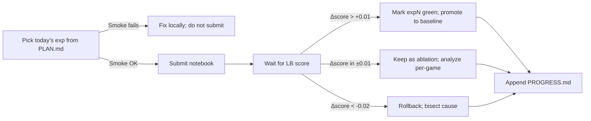

# EXPERIMENTS.md — End-to-End Daily Kaggle Submissions

> Each experiment = one Kaggle daily slot. Pre-flight every cell on a public game locally before submitting. Capture results here + in `.factory/memories.md`.

---

## Layout convention per experiment

```
experiments/expNNN_<short-slug>/
├── README.md          # 1-page rationale (problem, hypothesis, change vs prior, expected score)
├── notebook.ipynb     # Kaggle-ready notebook (or kaggle_notebook.py)
├── agent.py           # standalone agent module
├── smoke_test.py      # local invocation on 1–3 public games
├── score.txt          # public-LB score after submission
└── per_game_scores.csv (optional)
```

---

## Phase 0 — Foundation: anchor the baseline & understand the variance

> **Anchor**: the user already submitted a vanilla fork of **Ash's ARC-AGI-3 Agent** and got **LB 0.19** (rank 398). All later "Δ over baseline" numbers are vs **0.19**.
> **Critical question**: Ash's notebook is advertised at ~0.42 public, but our reproduction is 0.19 — a −0.23 gap. We MUST understand why before designing new agents.

### exp001_baseline_ash

- **Status**: SUBMITTED. **LB 0.19**, rank 398.
- **Notebook**: Vanilla fork of `Ash's ARC-AGI-3 Agent` (public, advertised ~0.42).
- See `experiments/exp001_baseline_ash/README.md`.

### exp002_ash_variance_probe

- **Hypothesis**: Ash's agent is highly stochastic — re-running the *same notebook* will produce scores spread across a wide range. If true, the published 0.42 was lucky and our 0.19 is unlucky; the *expected* score is somewhere in between.
- **Action** (D1 + D2 — uses 2 Kaggle daily slots):
  1. **D1**: Resubmit the SAME forked notebook unchanged — record score `s2`.
  2. **D2**: Resubmit again — record score `s3`.
  3. Compute mean(0.19, s2, s3) and stddev. If stddev > 0.05 → agent is variance-dominated.
- **Decision rule**:
  - If max(s2, s3) ≥ 0.30 → variance is the issue; can use Ash's notebook with multiple seeds + best-of-N as a free LB lift.
  - If max(s2, s3) < 0.25 → score is structurally low; abandon Ash's-as-baseline and switch to Stochastic Goose (exp003) or build our own (exp004+).
- **DoD**: 3 data points captured in `exp002_ash_variance_probe/scores.json`; decision rule executed and logged in `.factory/memories.md`.

### exp003_baseline_just_explore

- **Hypothesis**: Forking the `ARC3 Sample Submission - Just Explore` notebook will score ~0.19, comparable to our Ash reproduction but with a fully transparent agent loop. Lower-variance reference point.
- **Action** (D3): fork and submit Just-Explore unchanged.
- **DoD**: score recorded; agent loop annotated; reusable graph-state code identified for exp004+.

### exp004_local_runner_and_agents_skeleton

- **Hypothesis**: With a working local smoke runner (`experiments/local_runner.py`, already drafted) plus an `agents/` package that mirrors the SDK contract, every later experiment can validate offline before burning a Kaggle slot.
- **Action** (D4 — no Kaggle submission; pure plumbing day):
  1. Read `Ash's ARC-AGI-3 Agent` notebook line-by-line; extract the agent class to `agents/ash_agent.py`.
  2. Implement `agents/random_agent.py` and `agents/greedy_explore_agent.py` as known-low baselines (so we can verify the runner's plumbing works).
  3. Run `local_runner.py --agent agents.random_agent:RandomAgent --games ls20-mock` and confirm it returns valid stats.
  4. Run `local_runner.py --agent agents.ash_agent:AshAgent --use-sdk --games <real-game-ids>` for at least one real public game; verify level-completion counts and action histograms look sane.
- **DoD**:
  - All three agents importable; runner exits 0 for each.
  - The notebook agent + the extracted `AshAgent` class produce IDENTICAL trajectories on a fixed seed (sanity check that we lifted the code correctly).

---

## Phase 1 — Core search + learning agents

### exp005_trigger_aware_bfs_v1

- **Hypothesis**: A clean Trigger-Aware BFS with state hashing + graph dedup will score **≥ 0.30** (Δ ≥ +0.11 over our 0.19 baseline).
- **Approach**:
  - State hash = `xxhash64(uint8(grid).tobytes())` (or blake2b if xxhash unavailable in offline env)
  - Action queue = priority deque; priority = `trigger_score(state) + count_untried_actions(state)`
  - `trigger_score = abs(Δpixel_count) + 2·new_color_present + 5·levels_completed_changed`
  - State graph reset on `levels_completed` increment
- **Smoke**: passes ls20 tutorial; finishes in < 30 s on 1 game.
- **DoD**: ≥ 0.30 on Kaggle.

### exp006_stochastic_goose_pp

- **Hypothesis**: Re-implement StochasticGoose's CNN + change-prediction with the v0.9.3 SDK and tighten the per-level reset → **≥ 0.32** (Δ ≥ +0.13).
- **Approach**: 16-channel one-hot 64×64 input, 4-layer CNN (32→64→128→256), 5-way action head + 64×64 conv coordinate head, BCE on `frame_changed`. Hash-deduped 200K buffer. Reset on level transition.
- **DoD**: ≥ 0.32 on Kaggle.

### exp007_hybrid_search_and_learn

- **Hypothesis**: Combining BFS frontier with CNN frame-change prior in a single agent → **≥ 0.35** (Δ ≥ +0.16; matches "Hybrid Search-and-Learn" public notebook).
- **Approach**:
  - When BFS visits a new state, query CNN(state) → `p_change(action)`.
  - Insert action `a` into the BFS frontier with priority `α·p_change[a] + β·trigger_score` (α=2, β=1).
  - For ACTION6, sample top-k click coords from the conv coord head.
- **DoD**: ≥ 0.35 on Kaggle.

---

## Phase 2 — Object-centric & world-model

### exp008_segmentation_clickable_objects

- **Hypothesis**: Replacing 64×64 ACTION6 sampling with click-on-object centroids reduces wasted actions by >30% → **≥ 0.40** (Δ ≥ +0.21).
- **Approach**:
  - Per-frame, run connected-component labeling per color (scipy `label` + `find_objects`).
  - Maintain `Object{id, color, bbox, centroid, size}`.
  - For ACTION6: sample objects weighted by (size·saliency_tier_inverse).
  - Saliency_tier from Just-Explore heuristic: bigger + non-edge + non-status-bar → higher tier.
- **DoD**: ≥ 0.40 on Kaggle.

### exp009_mcts_neural_prior

- **Hypothesis**: AlphaZero-lite (MCTS + StochasticGoose CNN as prior) breaks **≥ 0.45** (Δ ≥ +0.26).
- **Approach**:
  - Build MCTS where:
    - selection: PUCT(s,a) = Q(s,a) + c·prior(s,a)·sqrt(ΣN)/(1+N(s,a)), c=1.5
    - prior(s,a) = softmax(CNN_action_logits(s))
    - value rollouts replaced by `value_head(s)` from CNN (trained jointly w/ change head)
  - Cap iterations per action ≤ 32; guarantee ≥ 1 action / 200 ms wall clock.
  - Reuse subtree on action commit (standard AlphaZero trick).
- **DoD**: ≥ 0.45 on Kaggle.

### exp010_dreamerv3_lite

- **Hypothesis**: A 5–10M-param RSSM world model + actor-critic on imagined trajectories matches MCTS but generalizes better to deep levels → **≥ 0.45** with better game-coverage variance.
- **Approach**:
  - Use `NM512/dreamerv3-torch` skeleton; trim to 64×64 input, 256-d latent.
  - Per game: train 1 RSSM update / env step in a background thread; act greedy on Dreamer policy after warm-up of 1k steps.
  - **Intrinsic reward** = ‖z_pred_{t+1} − z_actual_{t+1}‖² (ICM).
- **DoD**: ≥ 0.45 on Kaggle and < 5h runtime.

---

## Phase 3 — Test-time training, DSL synthesis, slot world models

### exp011_ttt_tiny_recursive_model

- **Hypothesis**: A 7M–10M-parameter Tiny Recursive Model (TRM-style) **pre-trained offline** on ARC-AGI-1/2 + public ARC-AGI-3 traces, then **full-FT for 1k steps in-game**, breaks **≥ 0.50**.
- **Approach**: ports McGovern's "Test-time Adaptation of Tiny Recursive Models" (arxiv 2511.02886) to interactive trajectories: input = (prev_frame, action, next_frame) triples, output = a small recursive controller predicting (next_action_logits, next_frame_delta).
- **DoD**: ≥ 0.50 on Kaggle.

### exp012_dsl_program_synthesis

- **Hypothesis**: Stitch-style library learning + MDL prior over short programs explains repeating mechanics across levels → unlocks deep levels (5+).
- **Approach**:
  - Define a tiny grid DSL: `move(d), fill(c), rotate(k), mirror(ax), copy(region), swap_color(a,b), …`
  - At level transition, search programs minimizing description length explaining trajectory(level_n).
  - Apply found program to predict reward-bearing action for level_n+1.
- **DoD**: solves at least one level of depth ≥ 5 on `ls20` or `ft09` reproducibly.

### exp013_slot_attention_world_model

- **Hypothesis**: Slot Attention-encoded latents + GNN predictor learn relational dynamics → +0.05 over DreamerV3 lite.
- **Approach**: 6-slot attention encoder over 16-channel one-hot grid, GNN (PyG) on slots → next-slot prediction. Plan in slot space with beam search width 8.
- **DoD**: ≥ 0.52.

### exp014_causal_intervention_planning

- **Hypothesis**: Maintaining a posterior over (object, action) → effect edges and using info-gain to pick the next action solves "puzzle" style games faster.
- **Approach**: For each (object_id, action_idx) keep `p_changes_object` (Beta posterior). At each step, sample action-object pair maximizing expected `−H(p)` reduction.
- **DoD**: ≥ 0.55.

---

## Phase 4 — Composition / ensemble / push to LB top

### exp015_per_game_dispatcher

- **Hypothesis**: Different agents win on different games. Per-game dispatcher (heuristic on first 50 actions: "is this clicky?", "are there moving objects?", "is the grid fixed?") routes to the right specialist → +0.05 over best single agent.
- **DoD**: ≥ 0.58.

### exp016_offline_pretrained_warm_start

- **Hypothesis**: Pre-train DreamerV3-lite + DSL library on **public games + community replays** (downloaded from `three.arcprize.org/replay/...`) packaged as Kaggle Dataset → faster in-game adaptation.
- **DoD**: ≥ 0.60.

### exp017_local_llm_orchestrator

- **Hypothesis**: A local 7B-quantized Qwen2.5-Coder GGUF model used **only as orchestrator** (decides "explore", "test hypothesis X", "lock in plan Y") combined with the symbolic+neural agents pushes us into LB-top range.
- **Approach**:
  - Load `Qwen2.5-Coder-7B-Instruct-Q4_K_M.gguf` (~5 GB) via `llama-cpp-python` packaged in Kaggle Dataset.
  - Token budget: ≤ 500 tokens per "decision call", at most 1 call per 50 env actions.
  - Mirror RGB-Agent's analyzer/queue split (action_queue.py) but with the local model.
- **DoD**: ≥ 0.65.

### exp018_ensemble_with_action_efficiency_tiebreak

- **Hypothesis**: Run BFS+CNN, MCTS, DreamerV3-lite, DSL synthesizer **in cascade** until any one wins each level, picking the agent with the lowest action count per level → final push toward 0.70+.
- **Approach**:
  - Order = [BFS+CNN (cheap), DSL (medium), MCTS (medium-heavy), DreamerV3 (heavy)].
  - For each level: run cheapest first up to 80% of typical budget; if not won, escalate.
  - On WIN, never run heavier ones for that level.
- **DoD**: ≥ 0.70.

---

## Daily decision flow



## Pre-flight checklist (every day)

- [ ] Notebook installs `arc-agi` from local wheels (no internet)
- [ ] All custom modules importable (`agent`, `simulator`, `state_graph`)
- [ ] Smoke test: `python local_runner.py --agent expNNN.agent:Agent --games ls20 --max-actions 50` returns WIN/levels
- [ ] Estimated total wall-clock < 5h (leave 1h buffer)
- [ ] State-graph reset on level transition is asserted in unit test
- [ ] Frame-hash collision rate on 10k random states < 1e-6
