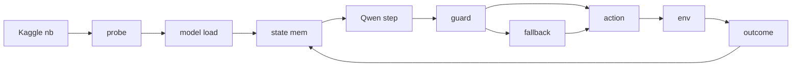

# Qwen RTX 6000 Revival Plan

> Date: 2026-05-14
>
> Scope: revive `exp004_qwen_agent` after Kaggle's ARC-AGI-3 update:
> notebook-only submissions, CPU/GPU runtime <= 9h, internet disabled,
> freely/publicly available external data allowed, automatic submission
> generation, and RTX 6000 (`g4-standard-48`) accelerators restricted to
> ARC-AGI-3 notebooks.

## Current status (2026-05-14 D16)

Phase 0 is complete on a dev/probe kernel. `qwen-rtx6000-probe-arc-agi-3`
v6 ran with `--accelerator NvidiaRtxPro6000`, confirmed 94.97 GB VRAM,
loaded offline Pillow/transformers overlays, loaded Qwen3.6-35B-A3B BF16
in ~421s with 70.214 GB CUDA allocation, and generated terse action
outputs when `enable_thinking=False` was passed to
`processor.apply_chat_template`. Next: Phase 1 guarded smoke with
state-graph/segmenter candidates and trigger-bfs+segmenter fallback.

## Strategic thesis

Qwen direct policy is worth re-testing because RTX 6000 changes the
hardware envelope and the 9h runtime cap gives more room than the earlier
6h target. But exp004 failed for reasons beyond hardware: no state graph,
weak no-change feedback, deterministic action collapse, slow vision
prefill, and no robust ACTION6 coordinate path.

The revived track should therefore be:

> Qwen as a constrained game-playing policy with explicit state memory,
> segmenter click candidates, strict machine-readable outputs, replayable
> reasoning logs, and safe graph-search fallback.



Legend: `state mem` = state graph + recent outcome memory; `guard` =
parser / validity / no-repeat checks; `fallback` = trigger-bfs +
frame-segmenter.

## Phase 0 — Compliance + RTX probe foundation

1. **Notebook-visible code**
   - Do not rely on private `cataluna84/arc-agi-3-agents-pkg` for
     prize-relevant submitted code.
   - Build Qwen notebooks with a generator, like exp008, so the notebook
     visibly contains the source needed for `my_agent.py`.
   - Inline only the minimal modules needed for the selected variant:
     Qwen backbone, Qwen policy wrapper, state graph, frame segmenter,
     and safe fallback.

2. **Public model/data check**
   - Prefer public Kaggle Model sources for Qwen if available.
   - If using the existing mirrored Qwen dataset
     `cataluna84/qwen3-6-35b-a3b-bf16`, make it public and verify license
     compatibility before prize-relevant submission.
   - Any wheel dataset used for offline installs must also be public or
     replaced by packages already on the Kaggle image.

3. **RTX probe**
   - Run an internet-disabled notebook attached to ARC-AGI-3 and requested
     with the RTX accelerator.
   - Record GPU name/count/VRAM, CUDA, PyTorch, `transformers`, `vllm`,
     `flash-attn`, `flashinfer`, `xformers`, and max allocatable VRAM.
   - Optionally test Qwen config/model load from the mounted local model.

**Gate:** continue only if the probe gives a reproducible offline model
loading path and the notebook remains compliant.

## Phase 1 — Qwen Direct Policy++

**Status (D19, 2026-05-17)**: BUILT + SMOKED + SUBMITTED. After two fixes
applied across D17-D19:

1. **Masked hash** (`agents.qwen_agent.hash_frame_masked`): primary-layer
   only + status-bar mask. Resolves multi-layer drift.
2. **Path B — tried-clicks in prompt**: per-state click history surfaced
   in the LLM prompt so it can avoid known-no-change coords on
   ACTION6-only games where action-id rotation is impossible.

Dev kernel v6 4-game smoke (ls20, ft09, vc33, lp85 × 100 actions each):
**5/5 gates pass** (aggregate `no_change_rate` 0.575 → 0.322). vc33 and
lp85 each clear L1 (lp85 was 0 → 1 with Path B). ft09 still stuck because
the segmenter doesn't surface its interactive region — Phase-1.5 work.
Comp kernel `cataluna84/qwen-phase1-comp-arc-agi-3` v1 push: COMPLETE in
save-mode. Comp submission **ref 52740633** at 2026-05-17 11:41 UTC scored
**LB 0.12** — exactly equal to the D15/D17 trigger-bfs-segmenter floor.
Dev-smoke wins on vc33 + lp85 did not propagate to the broader 110-game
public eval, suggesting the segmenter's tier-0/1 candidate set misses
the interactive region on many games (same failure mode as ft09 in dev).
Phase 1.5 owed: richer candidate generation (tier 2/3 + non-segmenter
fallbacks) before another Qwen comp submit.

**Earlier D17 status (history)**: First smoke (no fix) showed 4/5 gates pass,
no_change_rate=0.575 (FAIL). D17 slot used on trigger-bfs-segmenter v1
fallback (ref 52682163, scored 0.12).

**D20 update (2026-05-18)**: D19 result was 0.12 (= trigger-bfs floor).
Diagnosis: segmenter tier 0-1 candidates miss the interactive region on
many private games. Phase 1.5 fix shipped (`_DEFAULT_CANDIDATES` 8 → 14
+ 9 geometric fallback coords). D20 submission ref **52783366 PENDING**
at 2026-05-18 16:40 UTC.

Qwen chooses every action, but receives structured state context and is
constrained by guards.

Prompt inputs:

- current frame image at `QWEN_FRAME_UPSCALE=2` or `4`;
- available actions;
- current level progress;
- state-hash visit count;
- untried actions for this exact state;
- recent outcomes: `no-change`, `changed +N px`, `LEVEL UP`;
- ACTION6 candidate clicks from frame segmentation.

Output target:

```json
{"action": "ACTION6", "x": 12, "y": 8, "why": "candidate C3"}
```

Runtime targets:

- `QWEN_RUNTIME=vllm` first, `transformers` only as fallback.
- Prefix caching enabled.
- `QWEN_MAX_NEW_TOKENS=8..16` for action-only mode.
- Temperature `0.2..0.7` and top-p `0.8..0.95`.
- BF16 if it fits; otherwise public AWQ/FP8-compatible variants.

Guards:

- parse invalid JSON with regex fallback;
- snap to `available_actions`;
- avoid actions already known to no-change at the current state;
- fill missing ACTION6 coordinates with a segmenter candidate;
- fall back to trigger-bfs + segmenter on model failure.

**Gate:** dev smoke must show valid actions, bounded latency, and at
least `ls20` L1 progress before any competition submission.

## Phase 2 — Candidate-action direct policy

Qwen still chooses the next action, but only from a generated candidate
set:

- untried simple actions;
- top `K=16..64` segmenter click candidates;
- short macros discovered by the state graph.

Prompt target:

```json
{"choice": "C0"}
```

This uses Qwen as a semantic ranker over interaction affordances rather
than asking it to invent arbitrary coordinates.

## Phase 3 — Qwen mode-controller direct policy

Qwen chooses the exploration mode each turn; deterministic code executes
the chosen mode:

- `EXPLORE_SIMPLE`
- `EXPLORE_CLICK`
- `REPLAY_BEST`
- `UNDO_BACKTRACK`
- `SCAN_OBJECTS`

Prompt target:

```json
{"mode": "EXPLORE_CLICK", "target": "tier0_non_background", "budget": 5}
```

This attacks the strategy-selection problem: switching between movement,
clicking, replay, and backtracking.

## Phase 4 — Qwen hypothesis bank

Every plateau or fixed action interval, summarize transitions and ask
Qwen for hypotheses:

- candidate mechanics;
- promising object/action tests;
- avoid list;
- next experiment sequence.

The graph/segmenter code turns those hypotheses into concrete actions.

## Phase 5 — Qwen replay critic

Every 25-50 actions, show Qwen a compact replay summary and ask for a
strategy update. This amortizes Qwen cost and gives it causal evidence
instead of a single frame.

## Phase 6 — Qwen teacher, tiny student

If Qwen choices have signal but are too slow:

1. log `(frame features, graph features, candidates, Qwen choice, outcome)`;
2. train a tiny ranker / MLP / CNN over candidate features;
3. use the student for most actions and Qwen only on uncertainty.

## Submission gate

Do not burn a daily competition slot unless the selected variant is:

- notebook-based and code-visible;
- internet-disabled;
- backed only by public/free model and data sources;
- RTX-requested and verified in-notebook;
- extrapolated under 8h, leaving buffer under the 9h cap;
- guarded against uncaught model/parser/runtime exceptions;
- better than the current baseline family on public/dev smokes by level
  clears, no-change rate, or action efficiency.

## Recommended order

1. Phase 0: compliance + RTX probe.
2. Phase 1: guarded Qwen direct policy on 1-3 public games.
3. Phase 2: candidate-action direct policy.
4. Phase 3: mode-controller policy.
5. Phase 4/5: hypothesis bank + replay critic.
6. Phase 6: teacher/student if Qwen signal is useful but too slow.
